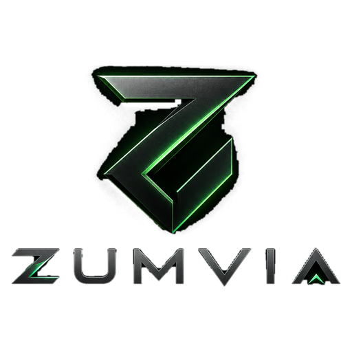

<p align="center">
  
</p>

<h1 align="center">ZUMVIA</h1>

<p align="center">
  <b>Paranızı yöneten otonom yapay zeka komutanı.</b><br>
  Zero-Hallucination · Neuro-Symbolic · Açık Kaynak
</p>

<p align="center">
  
  
  
  
  
</p>

Finans bilmenize gerek yok. Tek bir cümle yazarsınız —
*"Kriptoda 1000 dolarımı yönet, gerisini sen hallet"* — ve ajan gerisini yapar:
piyasayı okur, kendi görüşünü bağımsız algoritmik motorla çapraz doğrular,
haberleri tarar, geri testle kanıt toplar, botu kurar, çalıştırır, denetler ve
**her adımı size gösterir.**

> **Bu yazılım finansal tavsiye vermez ve kâr garantisi içermez.**
> Ticaret sermaye kaybı riski taşır. Varsayılan olarak sanal (paper) modda
> çalışır. Gerçek paraya geçmeden önce en az 30 gün sanal modda çalıştırıp
> sonuçları ölçün. Sorumluluk kullanıcıya aittir.

---

## İçindekiler

- [Neden bu sistem?](#neden-bu-sistem)
- [Karar kalitesi modları](#karar-kalitesi-modları)
- [Mimari](#mimari)
- [Kurulum](#kurulum)
- [İlk kullanım](#i̇lk-kullanım)
- [Yapay zeka modeli seçimi](#yapay-zeka-modeli-seçimi)
- [Kontrol aracı: API · Claude Code · Codex](#kontrol-aracı-api--claude-code--codex)
- [MCP sunucusu](#mcp-sunucusu)
- [Risk kalkanı](#risk-kalkanı--değiştirilemez-kurallar)
- [Kâr odaklı motorlar](#kâr-odaklı-motorlar)
- [Toparlanma motoru](#toparlanma-motoru--zararı-nasıl-telafi-eder)
- [Algoritmik strateji motoru](#algoritmik-strateji-motoru-aisız-da-çalışır)
- [Sistem botları](#sistem-botları--yapay-zeka-bot-yazmaz)
- [Gerçek paraya geçiş](#gerçek-paraya-geçiş)
- [7/24 sunucuda çalıştırma](#724-sunucuda-çalıştırma)
- [Güvenlik](#güvenlik)
- [Geliştirme ve testler](#geliştirme-ve-testler)
- [Proje yapısı](#proje-yapısı)
- [SSS](#sss)

---

## Neden bu sistem?

Piyasada iki uç var: (1) hiçbir şey anlamadığınız kara kutu botlar,
(2) her şeyi kendiniz kurmanızı isteyen karmaşık altyapılar.
ZUMVIA ikisini de çözer:

| Sorun | Bu platformdaki çözüm |
|---|---|
| Dil modelleri sayı uydurur (halüsinasyon) | **Tüm matematik Python'da.** LLM sadece hazır sayıları yorumlar |
| Model saçmalarsa hesap sıfırlanır | **Katman 4 risk kalkanı** kodda; ajan bile aşamaz |
| API kotası biterse bot durur | **Algoritmik motor devralır** — 12 klasik strateji, maliyet $0 |
| Kullanıcı ayar bilmiyor | **Ajan kendisi kurar**; kullanıcı tek cümle yazar |
| Ne olduğunu göremezsiniz | **Her araç çağrısı chat'te görünür** — girdi, çıktı, süre |
| Zarardan sonra panik | **Toparlanma planı**: risk küçülür, eşik yükselir, başabaş yolu sayıyla gösterilir |
| Tek modelin hatası | **Çoklu model konseyi**: paralel oy, risk eleştirmeni vetosu, medyan seviyeler |
| Aşırı uyumlu geri test | **Walk-forward doğrulama** ve `overfit_gap` reddi |
| Aynı bahsi 3 kez almak | **Korelasyon kalkanı** + portföy ısısı tavanı |
| Gerçek para korkusu | **Limitli, süreli, tek tıkla iptal edilebilir yetki** + acil fren |

---

## Arayüz

- **Komuta merkezi** — ajanla sohbet; her araç çağrısı ayrı bir adım kartı olarak
  görünür (ne yaptı, ne buldu, kaç ms sürdü). Karta tıklayınca ham girdi/çıktı açılır.
- **Komut paleti** — `Ctrl+K` ile sayfa, görev, bot ve hızlı eylem araması.
- **Kontrol merkezi** — güvenlik (acil fren, gerçek para yetkisi), anahtarlar,
  model sicili, raporlar, MCP bağlantıları ve değiştirilemez sınırlar.
- **Finans çalışma alanı** — canlı piyasa panosu, enstrüman arama ve filtreleme,
  fiyat grafikleri, haber akışı ve bağlama duyarlı finans asistanı tek ekranda.
- **Tutarlı ikon sistemi** — emoji yok; tüm ikonlar tek çizgi kalınlığında SVG.
- **Next.js arayüzü** masaüstü ve mobil için duyarlı, animasyonlu ve erişilebilir
  bir deneyim sunar.

---

## Karar kalitesi modları

Kullanıcının yapması gereken **tek seçim** budur. Geri kalan her şeyi (hangi
aracı, hangi botu, hangi stratejiyi kullanacağını) ajan kendisi belirler.

| Mod | Nasıl çalışır | Ne zaman |
|---|---|---|
| **Otomatik** | Tek anahtar varsa tek model, iki+ anahtar varsa konsey | Varsayılan — düşünmeyin |
| **Tek Model** | Bir model karar verir | En hızlı ve en ucuz |
| **Konsey** | Modeller **paralel** bakar, ağırlıklı oy, medyan seviyeler | Ciddi sermaye |
| **Sağlamcı** | Konsey + risk eleştirmeni + hakem + algoritma mutabakatı | En az işlem, en yüksek kalite |

**Konsey nasıl karar verir?**

1. Tüm analist modeller aynı deterministik veriyi alır ve **eş zamanlı** çalışır.
2. Oylar **sicil ağırlığıyla** toplanır (doğru karar veren modelin sözü artar).
3. Stop ve hedef, anlaşan üyelerin **medyanı** alınarak koddan üretilir —
   hiçbir modelin serbest metni doğrudan emre dönüşmez.
4. Seviyelerde ciddi ayrışma varsa "kanaat zayıf" sayılır → **işlem yok**.
5. Sağlamcı modda bir model **risk eleştirmeni** olur ve veto yetkisi vardır;
   analistler bölünürse **hakem** taraf seçer, seçemezse beklenir.

> Bölünmüş konsey işlem açmaz. Belirsizlikte beklemek disiplindir.

---

## Mimari

```
┌──────────────────────────────────────────────────────────────────┐
│  KOMUTA AJANI  (chat · araç çağırmalı döngü · 7/24 otonom tur)   │
│  Kontrol aracı: API modeli │ Claude Code │ Codex │ Gemini CLI    │
│  Alt model (analist): ikinci görüş için delege edilir            │
└───────────────────────────────┬──────────────────────────────────┘
                                │ 37 araç
┌───────────────────────────────▼──────────────────────────────────┐
│ KATMAN 1  Piyasa verisi      ccxt (100+ borsa) · yfinance        │
│ KATMAN 2  Matematik motoru   RSI · EMA · MACD · BB · ATR · ADX   │
│           %0 halüsinasyon    Supertrend · Stochastic · VWAP      │
│ KATMAN 2.5 Strateji motoru  12 klasik strateji + ağırlıklı oy    │
│           Tarayıcı           24 pariteyi eş zamanlı skorlama     │
│           Doğrulayıcı        Walk-forward + aşırı uyum ölçümü    │
│ KATMAN 3  Model konseyi      Gemini · DeepSeek · Claude · Qwen   │
│           Pydantic şeması    OpenAI · Groq · Ollama · vLLM       │
│           Risk eleştirmeni   veto · hakem · sicil ağırlığı       │
│ KATMAN 4  RİSK KALKANI    Zorunlu SL · %1.0 tavan · 1:2 R/R   │
│           (kırılmaz)         Devre kesici · dinamik lot          │
│           Portföy kalkanı    ısı tavanı · korelasyon · spread    │
│           Toparlanma motoru  drawdown → risk küçülür             │
│ KATMAN 5  İcra + bildirim    Paper / Canlı · kısmi kâr · Telegram│
│ GÜVENLİK  Acil fren · limitli+süreli canlı yetki · denetim izi   │
└──────────────────────────────────────────────────────────────────┘
```

**Nöro-sembolik** demek: sayısal kesinlik koddan (sembolik), yorum ve sentez
modelden (nöral), **nihai yetki her zaman koddan** gelir.

---

## Kurulum

### Yol 1 — Docker (önerilen, tek komut)

Gereken: **Docker**. Başka hiçbir hazırlık yok — güvenlik anahtarları ilk
açılışta otomatik üretilir ve kalıcı birimde saklanır.

```bash
docker compose up -d
```

Tarayıcıdan **http://localhost:8000** adresine gidin. Durdurmak için
`docker compose down`; veriler adlandırılmış birimde (`zumvia-data`) kalır.

Güncelleme:

```bash
docker compose pull; docker compose up -d --build
```

> Kapsayıcı yalnızca `127.0.0.1` üzerinde dinler. Ağa açacaksanız
> `docker-compose.yml` içindeki port satırını değiştirin ve **mutlaka** ters
> vekil (HTTPS) veya VPN arkasına alın.

### Yol 2 — Python (geliştirme için)

Gereken: **Python 3.11+**. Node.js gerekmez — arayüz backend ile birlikte gelir.

```bash
git clone <repo-url> zumvia
cd zumvia/backend
python -m venv .venv
```

Sanal ortamı etkinleştirin:

```bash
# Windows
.venv\Scripts\activate
```

```bash
# Linux / macOS
source .venv/bin/activate
```

Bağımlılıkları kurun ve başlatın:

```bash
pip install -r requirements.txt
```

```bash
uvicorn app.main:app --host 0.0.0.0 --port 8000
```

Tarayıcıdan **http://localhost:8000** adresine gidin. Şifreleme ve oturum
anahtarları ilk açılışta üretilip `backend/.secrets.env` dosyasına yazılır.

> **Üretimde:** anahtarları kendiniz belirlemek isterseniz `cp .env.example .env`
> yapıp `VQ_MASTER_KEY` ve `VQ_JWT_SECRET` satırlarını doldurun. Ana anahtarı
> kaybederseniz kasadaki API anahtarları **çözülemez** — yedekleyin.

---

## İlk kullanım

1. **Hesap oluşturun** (e-posta + parola; veriler yerelde kalır).
2. Sol alttaki **profil → Ayarlar → Anahtar ekle** ile bir yapay zeka anahtarı girin.
   En ucuz başlangıç: [Google AI Studio](https://aistudio.google.com/apikey) →
   ücretsiz Gemini anahtarı (aylık ~$0).
3. **Komuta** ekranında yazın:

   > Kriptoda 1000 dolarımı yönet, gerisini sen hallet.

Ajan sırayla: portföyü okur → piyasayı çeker → algoritmik motorla çapraz
doğrular → geri test yapar → botu kurar → çalıştırır → size özet verir.
Her adımı satır satır görürsünüz; bir adıma tıklayınca ham girdi/çıktı JSON'u açılır.

**Hiç anahtarınız yoksa** bile sistem çalışır: bot oluştururken
*"Sadece Algoritma"* karar modunu seçin — 12 klasik strateji yapay zeka olmadan,
tamamen ücretsiz çalışır.

---

## Model seçimi — liste canlı çekilir

Sağlayıcılar model isimlerini sık değiştirir; koda gömülü liste birkaç ayda
eskir. ZUMVIA, kaydettiğiniz anahtarla sağlayıcının kendi model uç noktasını
sorgular ve **güncel listeyi** gösterir.

- Uç nokta yanıt vermezse hata verilmez: bilinen liste gösterilir ve nedeni
  yazılır ("Sağlayıcı model listesi vermedi — bilinen liste gösteriliyor").
- Sohbete uygun olmayan modeller (gömme, ses, görüntü, moderasyon) elenir.
- Listede olmayan bir modeli **elle yazabilirsiniz**: model seçicideki
  *"Model adını elle yaz…"* seçeneği. Doğrulama yapılmaz — sağlayıcı yarın yeni
  bir model çıkarabilir ve sizi bekletmemeliyiz.

---

## Yapay zeka modeli seçimi

Kasaya birden fazla sağlayıcı ekleyip istediğiniz an değiştirebilirsiniz.
Model değişse de **davranış sözleşmesi değişmez**: hepsi "profesyonel fon
yöneticisi" personasıyla ve aynı JSON şemasıyla çalışır.

| Sağlayıcı | Örnek modeller | Notlar |
|---|---|---|
| Google Gemini | `gemini-2.5-flash`, `gemini-2.5-pro` | Ücretsiz kota — en ucuz başlangıç |
| DeepSeek | `deepseek-chat`, `deepseek-reasoner` | Fiyat/performans lideri, derin muhakeme |
| Anthropic | `claude-sonnet-4-5`, `claude-3-5-haiku-latest` | Makro ve bilanço analizinde güçlü |
| OpenAI | `gpt-4o`, `o3-mini` | Karmaşık portföy dağılımı |
| Qwen | `qwen-max`, `qwen-plus` | Alternatif, uygun fiyat |
| Groq | `llama-3.3-70b-versatile` | Ultra hızlı |
| OpenRouter | yüzlerce model | Tek anahtarla hepsi |
| **Ollama / vLLM** | `qwen2.5:14b`, `llama3.1:8b` | **Yerel · $0 · veri dışarı çıkmaz** |
| Özel | herhangi bir OpenAI-uyumlu uç | `base_url` + model adı yazın |

---

## Kontrol aracı: API · Claude Code · Codex

Komuta ajanının "beyni" olarak dört seçenek vardır (chat ekranının alt çubuğundan
anında değiştirilir):

| Kontrol aracı | Nasıl çalışır | Kurulum |
|---|---|---|
| **API (doğrudan model)** | Seçtiğiniz modeli araç çağırmalı döngüde çalıştırır | Yok — varsayılan |
| **Claude Code** | Yerel `claude` CLI ajanını komutan yapar | `npm i -g @anthropic-ai/claude-code` |
| **Codex CLI** | Yerel `codex` CLI ajanını komutan yapar | `npm i -g @openai/codex` |
| **Gemini CLI** | Yerel `gemini` CLI ajanını komutan yapar | `npm i -g @google/gemini-cli` |

CLI seçildiğinde platform, ajana geçici bir görev brifingi (yetki çerçevesi,
API adresi, kısa ömürlü token ve araç listesi) verir; CLI ajanı araçları HTTP
üzerinden çağırır. **Risk kalkanı bu yolda da geçerlidir.**

---

## MCP sunucusu

Platformun **69 aracını** Model Context Protocol ile dışarı açar. Claude Code
(terminal veya masaüstü), Claude Desktop, Codex, Cursor — MCP destekleyen her
araç bu platformun komutanına dönüşür.

Panelde **profil → Kontrol merkezi → Bağlantılar** sekmesinden her araç için
ayrı, adlandırılmış ve **tek tıkla iptal edilebilir** bir erişim anahtarı
üretirsiniz; sayfa hazır komutları anahtarınız gömülü hâlde kopyalar.

Anahtarlar `vq_` ile başlar, veritabanında yalnızca SHA-256 özeti saklanır ve
düz metin bir kez gösterilir. Kullanım sayısı ve son kullanım zamanı izlenir.

Ayrıntılı rehber: [docs/MCP-KURULUM.md](docs/MCP-KURULUM.md)

### Masaüstü uygulamaları (HTTP)

Sunucu çalışırken uygulamanıza şu adresi ekleyin:

```
http://127.0.0.1:8000/mcp
Authorization: Bearer <panelden aldığınız erişim anahtarı>
```

Claude Code ile tek komutta:

```bash
claude mcp add --transport http zumvia http://127.0.0.1:8000/mcp --header "Authorization: Bearer <TOKEN>"
```

### Terminal ajanları (stdio — ağ gerekmez)

```bash
claude mcp add zumvia -- python /tam/yol/backend/mcp_server.py
```

Anahtarı ortam değişkeniyle verin: `VQ_MCP_TOKEN=vq_…`

Veya projenizin `.mcp.json` dosyasına:

```json
{
  "mcpServers": {
    "zumvia": {
      "command": "python",
      "args": ["/tam/yol/backend/mcp_server.py"],
      "env": { "VQ_MCP_USER": "siz@ornek.com" }
    }
  }
}
```

Bağlandıktan sonra ajana şunu diyebilirsiniz:

> Portföyüme bak, BTC/USDT'de fırsat var mı kontrol et, algoritmik motorla
> doğrula ve uygunsa bir bot kur.

MCP üzerinden gelen çağrılar da **aynı risk kalkanından** geçer: stopsuz işlem
açılamaz, tavanlar aşılamaz, gerçek para yetkisi verilemez. Yazma yetkisi olan
araçlar `destructiveHint` ile işaretlenir; istemciniz bunlar için onay isteyebilir.

---

## Risk kalkanı — değiştirilemez kurallar

Bunlar `app/layers/l4_risk.py` içinde koda gömülüdür. Ne kullanıcı, ne ajan,
ne de MCP istemcisi aşabilir:

| Kural | Değer | Ne işe yarar |
|---|---|---|
| Tek işlemde kasa riski | **en fazla %1.0** | 20 üst üste zararda bile hesap durur, sıfırlanmaz |
| Zorunlu stop-loss | **her işlemde** | Stopsuz veya mantıksız stoplu emir açılamaz |
| Risk/Ödül | **en az 1:2** | Asimetri yoksa işlem yok |
| Minimum güven | **%75** | Kararsız modelin işlemi geçmez |
| Günlük devre kesici | **%3 kayıp** | Tüm pozisyonlar kapanır, bot 24 saat kilitlenir |
| Toplam drawdown | **%15 (ayarlanabilir)** | Zirveden düşüşte bot durur |
| Notional tavanı | **kasanın tamamı ≤ 1×** | Kasanın hepsi tek pozisyona girmez |
| Stop mesafesi | **%0.1 – %12** | Ne gürültüye takılır ne aşırı maruziyet |

**Dinamik lot formülü** (canlıda ve geri testte birebir aynı):

```
Pozisyon = (Kasa × Risk%) / |Giriş − Stop-Loss|
```

**Toparlanma (Recovery) modu:** Zirveden %5 düşüşte veya 2 üst üste zararda
otomatik açılır — risk **yarıya iner**, güven eşiği **yükselir**, yalnızca A+
kurulumlar alınır. Kaybı kapatmak için risk artırmak (martingale) **kod
seviyesinde imkansızdır**; hesapları sıfırlayan tek şey odur.

---

## Kâr odaklı motorlar

Risk kalkanı sizi korur; bu motorlar **kazanma olasılığını** artırır.

### Fırsat tarayıcı — `scan_markets`

Tek pariteye bakıp beklemek amatör yaklaşımdır; piyasanın çoğu zaman yatay
olduğunu unutmayın. Tarayıcı 24 enstrümanı **paralel** tarar ve her biri için
deterministik fırsat skoru üretir:

```
skor = konsensüs gücü + trend kalitesi (ADX) + teknik uyum
     + volatilite sağlığı + hacim teyidi − likidite cezası (geniş spread)
```

### Walk-forward doğrulama — `validate_strategy`

Geri testin en tehlikeli yanı **aşırı uyumdur**: yeterince parametre denerseniz
geçmişte harika görünen ama gelecekte para kaybettiren bir yapılandırma mutlaka
bulursunuz. Doğrulayıcı veriyi ardışık eğitim/test pencerelerine böler ve
**yalnızca görülmemiş veri** performansını raporlar.

`overfit_gap` (eğitim PF − test PF) 0.6'yı aşarsa yapılandırma **reddedilir**.

### Yapılandırma optimizasyonu — `optimize_setup`

Zaman dilimi × strateji seti × konsensüs eşiği kombinasyonlarını dener ve
en iyisini **görülmemiş veri performansına göre** seçer.

### Portföy kalkanı

| Koruma | Ne yapar |
|---|---|
| **Portföy ısısı** | Tüm açık pozisyonlardaki toplam risk tavanı (varsayılan %3). Stopu başabaşa çekilmiş pozisyon ısıya dahil edilmez |
| **Korelasyon kalkanı** | BTC long açıkken ETH long **ayrı işlem değildir**; gerçek getiri korelasyonu ≥0.70 ise küme reddedilir |
| **Spread filtresi** | Geniş spreadli, likiditesi düşük pariteler elenir |

### Kısmi kâr alma (scale-out)

Fiyat lehe 1.5R gittiğinde pozisyonun yarısı kapatılır ve stop başabaşa çekilir:
kalan pozisyon **risksiz** olarak büyük hareketi kovalamaya devam eder.
Kurumsal masaların standart uygulamasıdır; kazanma oranını ve beklentiyi yükseltir.

---

## Toparlanma motoru — zararı nasıl telafi eder?

Amatör refleks: kaybı hızlı kapatmak için riski büyütmek (martingale).
Matematiksel sonucu iflastır, çünkü drawdown asimetriktir:

| Kayıp | Başabaş için gereken kazanç |
|---|---|
| %10 | %11.1 |
| %20 | %25.0 |
| %30 | %42.9 |
| %50 | %100.0 |

Bu yüzden sistem tam tersini yapar — **kayıp derinleştikçe risk küçülür**:

| Aşama | Tetik | Risk katsayısı | Ek kurallar |
|---|---|---|---|
| Normal | — | ×1.00 | Standart profil |
| Savunma | DD ≥ %5 veya 2 zarar | ×0.50 | Güven +0.08, konsensüs +1, trende ters işlem yok |
| Sermaye Koruma | DD ≥ %10 | ×0.33 | Aynı anda 1 pozisyon, yalnızca A+ kurulum |
| Kilit | DD ≥ %18 | ×0.20 | Minimum risk, strateji gözden geçirilmeli |

Ajan `get_recovery_plan` ile şu soruyu **sayıyla** yanıtlar: *"Başabaşa dönmek
için ne kadar kazanç, kaç R ve tahminen kaç disiplinli işlem gerekiyor?"*

---

## Algoritmik strateji motoru (AI'sız da çalışır)

İnternet kesilse, kota bitse veya model yanıt vermese bile bot çalışmaya devam eder.

| Strateji | Mantık | Ağırlık |
|---|---|---|
| `trend_following` | EMA50/200 + Supertrend + ADX | 1.4 |
| `pullback_ema` | Trendde EMA geri çekilmesi | 1.3 |
| `breakout` | Donchian(20) kırılımı + hacim teyidi | 1.2 |
| `squeeze_expansion` | Bollinger sıkışması sonrası patlama | 1.1 |
| `momentum_macd` | MACD kesişimi + EMA200 filtresi | 1.0 |
| `mean_reversion` | BB bantları + RSI (yalnız range rejiminde) | 0.9 |
| `rsi_divergence` | Fiyat/RSI uyumsuzluğu | 0.9 |
| `vwap_reversion` | Seansiçi VWAP sapması | 0.8 |
| `turtle_55` | Turtle 55 bar kırılımı, 2N stop | 1.3 |
| `chandelier_trend` | Chandelier Exit ile trend devamı | 1.2 |
| `stoch_pullback` | Trend yönünde stokastik dönüşü | 1.1 |
| `obv_thrust` | OBV hacim öncülüğü (gizli birikim) | 1.0 |

**Karar mimarileri** (bot başına seçilir):

- `hybrid` — YZ ve algoritma aynı yönü göstermezse **işlem açılmaz** (en güvenli)
- `ai_first` — YZ birincil; hata/kota durumunda algoritma devralır (kesintisiz)
- `algo_only` — Yalnızca kural tabanlı, **maliyet $0**, anahtar gerekmez
- `ai_only` — Kararı modele bırakır (risk kalkanı yine geçerli)

---

## Sistem botları — ve zayıf yanlarına karşı önlemler

Çoğu "AI trading" aracında model, kendi uydurduğu bir stratejiyi çalıştırır.
Burada öyle değil: **122 hazır ticaret sistemi** kodun içinde durur, testten
geçer ve sabittir. Bunlar 14 çekirdek yaklaşımın vade × risk iştahı
sürümleridir — rastgele kombinasyon değil, aynı tezin farklı grafik ve
pozisyon büyüklüğü ayarları.

| Yaklaşım | Ne zaman çalışır | Zayıf yanı | Buna karşı önlem |
|---|---|---|---|
| **Trend Sürücüsü** | Güçlü trend | Yatay piyasada testere | ADX < 20 ise işlem yok |
| **Geri Çekilme Avcısı** | Trendde dinlenme | Dinlenmeyen trendi kaçırır | Ana trend teyidi zorunlu |
| **Kırılım Avcısı** | Sıkışma sonrası | Sahte kırılım | Hacim teyidi (z ≥ 0.8) |
| **Bant Toplayıcı** | Yatay piyasa | Bant kırılınca büyük kayıp | ADX > 22 ise devre dışı |
| **Swing Çekirdek** | Her rejim | Sabır ister | Günde 1 işlem tavanı |
| **Volatilite Patlaması** | Yüksek oynaklık | Stop kayması | ATR > %8 ise durur |
| **Sermaye Koruma** | Zarardayken | Yavaş toparlanma | Yarım risk + 3 teyit |
| **Gün İçi Momentum** | Gün içi hareket | Komisyon erimesi | Spread > %0.06 ise yok |
| **Panik Alıcısı** | Trendde sert düşüş | Gerçek kırılımı panik sanar | EMA200 altında alım yok |
| **Trend Piramidi** | Teyitli güçlü trend | Kâr geri verme | ADX ≥ 22 + tek işlem |
| **Çift Momentum** | Fiyat + hacim uyumu | Hareketin başını kaçırır | — (bilinçli takas) |
| **Boşluk Kapanışı** | Aşırı tepki | Haber boşluğu kapanmaz | ADX tavanı + soğuma |
| **Düşüş Kalkanı** | Ayı piyasası | Ayı ralileri | Ana trend teyidi |
| **Yalnız Algoritma** | Model erişimi yokken | Bağlam okuyamaz | Tam deterministik |

**Önlemler süs değildir.** `app/layers/guards.py` içindeki filtreler her girişten
hemen önce çalışır; reddettiğinde pozisyon açılmaz ve gerekçe olay akışına
yazılır ("SİSTEM ÖNLEMİ · Trend gücü yetersiz (ADX 12.4 < 20)").

```
recommend_playbook  →  deterministik skor + gerekçe (aile başına en iyi sürüm)
deploy_playbook     →  sanal modda kurulum (strateji, risk, önlemler sistemden)
design_custom_bot   →  hiçbiri uymuyorsa ajan SİZE ÖZEL sistem tasarlar
```

### Özel botlarım — kendi sisteminiz

Ajan iki yoldan size özel sistem üretebilir; ikisi de **Özel botlarım**
bölümünde, bu cihazdaki veritabanında saklanır ve hiçbir yere gönderilmez:

| Araç | Ne yapar |
|---|---|
| `fork_playbook` | Çalıştığı bilinen bir sistemi **temel alır**, yalnızca istenen ayarı değiştirir. Korumalar orijinalinden miras kalır. |
| `design_custom_bot` | **Sıfırdan** tasarlar; stratejilerin doğasına göre koruma seti otomatik türetilir. |

Her ikisi de kurulmadan önce geçmiş veride sınanır. Şablonu silmek, o
şablonla kurulmuş **botları etkilemez** — onların ayarları kendi kayıtlarında
durur.

### Yapay zeka bot yazabilir mi?

Evet — ama serbestçe kod yazarak değil. `design_custom_bot` aracı, ajanın
platformun doğrulanmış yapı taşlarından yeni bir sistem kurmasına izin verir ve
kod seviyesinde şunları zorlar:

- Yalnızca var olan 12 stratejiden seçilebilir; uydurma isim **reddedilir**.
- Hemfikirlik eşiği strateji sayısını aşamaz, risk tavanı aşılamaz.
- Tez, **zayıf yan** ve kaçınma koşulu yazılmak zorundadır.
- Sistem, kurulmadan önce geçmiş veride **otomatik doğrulanır**; kâr faktörü
  1.2'nin veya 8 işlemin altındaysa "doğrulanmadı" damgası alır ve bu bilgi
  hem araç çıktısında hem arayüzde görünür.

---

## Çok ajanlı iç iletişim

*Sağlamcı* modda konsey iki tur çalışır:

1. **Bağımsız tur** — her analist diğerlerinden habersiz karar verir
   (grup düşüncesi oluşmasın).
2. **Müzakere turu** — her analiste masadaki TÜM gerekçeler gösterilir.
   Kaçırdığı bir kanıt varsa kararını değiştirir; kendi gerekçesi daha
   güçlüyse savunur. Fikir değiştirenler kayda geçer (`changed_mind`).

Ardından risk eleştirmeni veto hakkını kullanır, bölünme varsa hakem karar
verir. Seviyeler (stop/hedef) her zaman **kodda medyanla** birleştirilir —
müzakere fiyatı değil, yönü ve gerekçeyi etkiler.

---

## Web araştırması — fiyatın "ne", haberin "neden"i

Fiyat verisi ne olduğunu söyler, neden olduğunu söylemez. Ajan sert bir
hareketin arkasındaki sebebi arayabilir:

```
web_search  →  DuckDuckGo (API anahtarı GEREKMEZ), kaynaklarıyla sonuç
web_read    →  bir sayfanın okunabilir metni (kırpılmış)
```

**Güvenlik:** Web'den gelen metin ajana **veri** olarak verilir, talimat olarak
değil. Bir sayfada "riski yükselt" yazsa bile bu emir sayılmaz; ajanın sistem
talimatında bu kural açıkça yazılıdır ve testle korunur.

İnternet yoksa arama boş döner — ticaret motoru deterministik olarak çalışmaya
devam eder.

---

## İstem çevirisi

Arayüzü Arapça yapıp internetten bulduğunuz İngilizce bir istemi
yapıştırdığınızda, sistem metni **anlamını bozmadan** arayüz diline çevirir ve
orijinalini de kayıtta tutar. Finans terimleri (stop, short, BTC/USDT) korunur.

Kapatmak için: Kontrol merkezi → Sınırlar → *İstemi otomatik çevir*.
Çeviri başarısız olursa mesajınız **aynen** gider; hiçbir koşulda kaybolmaz.

---

## Güncelleme geldiğinde ne olur?

Para yöneten bir sistemde bu sorunun cevabı belirsiz olamaz
(`app/core/upgrade.py`, testleri `tests/test_upgrade.py`):

| Durum | Davranış |
|---|---|
| **Açık pozisyon** | **Asla kapatılmaz.** Kapatma kararı stratejiye, risk kalkanına veya size aittir. |
| Yama sürümü (1.0.**1**) | Hiçbir şey durmaz, botlar çalışmaya devam eder. |
| Ana sürüm (**2**.0.0) | Çalışan botlar duraklatılır — kapatılmaz. Kontrol edip tek tıkla devam ettirirsiniz. |
| Kullanılan sistem kaldırıldıysa | Bot durdurulur ve sebebi olay defterine yazılır. |
| Şema değişikliği | Yalnızca ekleyici (`ALTER TABLE ADD COLUMN`); kolon silinmez, geri dönüş mümkün kalır. |

---

## Emirlerin gerçekten nasıl gittiği

Plan hesaplamak yetmez; uygulanması gerekir. `app/engine/slicer.py` büyük
emri **veritabanına yazılan bir "çalışan emir"** hâline getirir ve ayrı bir iş
her 5 saniyede vadesi gelen parçaları gönderir:

| Durum | Davranış |
|---|---|
| Emir bar hacmine sığıyor | Tek parça, anında |
| Sığmıyor | TWAP parçalarına bölünür, her parça bar hacminin ≤ %8'i |
| Likiditeye hiç sığmıyor | Pozisyon **küçültülür**, sebebi yazılır |
| Fiyat aleyhte kayarsa | Kalan parçalar iptal — **dolan kısım korunur** |
| Acil fren | Kalan parçalar **bekletilir** (iptal değil) |
| Süreç çökerse | Ne kadarının dolduğu kayıtlı; pozisyon gerçek miktarla yaşar |

Koruyucu stop, **ilk parçadan hemen sonra** borsaya bırakılır: emir
tamamlanmasa bile pozisyon korumasız kalmaz.

---

## Mutabakat — platform kapalıyken piyasa durmadı

Süreç durduğunda borsa çalışmaya devam eder. Açılışta ve her 10 dakikada
`app/engine/reconcile.py` kaydı gerçekle eşitler:

- Borsada pozisyon yoksa → koruyucu stop tetiklenmiş, kayıt kapatılır.
- Koruyucu stop emri düşmüşse → yeniden bırakılır.
- Sanal modda stop/hedef seviyesi geçilmişse → o seviyeden kapatılır.
- **Borsa okunamıyorsa hiçbir şey yapılmaz.** "Bilinmiyor" ile "yok"
  karıştırılırsa geçici bir ağ hatası gerçek pozisyonu kaybettirir.
- Platformun bilmediği bir pozisyon bulunursa **dokunulmaz**, raporlanır.

---

## Uçuş öncesi kontrol

Canlı emirlerin çoğu piyasa yüzünden değil, **borsa kuralları** yüzünden
reddedilir. `app/layers/preflight.py` emri göndermeden önce doğrular: minimum
lot, minimum tutar (Binance'te 10 USDT), miktar hassasiyeti, bakiye, paritenin
işleme açık olup olmadığı. Borsa meta verisi vermiyorsa ticaret durmaz —
"doğrulanamadı" uyarısı eklenir.

`dry_run()` ile hiçbir emir göndermeden tam rapor alınabilir.

---

## Kanıt — 122 sistem değil, kaçının çalıştığı

`app/engine/evidence.py` kütüphaneyi **görülmemiş veride** (walk-forward)
sınar ve sonucu her sistem kartına iliştirir. Gerçek Binance verisiyle
(4 parite × 2+ yıl) üretilen son rapor:

| | |
|---|---|
| Ölçülebilen sistem | 10 / 14 |
| Görülmemiş veride geçen | **5** (%50) |
| Medyan kâr faktörü | 1.24 |
| En iyi | Swing Çekirdek (PF 5.23) |
| En kötü | Geri Çekilme Avcısı (PF 0.41) |

Doğrulamayı geçemeyen sistem kartında **uyarı rozetiyle** görünür ve kurmadan
önce onay ister. Bu bir gelecek getiri vaadi değildir; geçmiş veride ölçümdür.

---

## Büyük sermaye — limit yok, ama plan var

Sistemde **bakiye tavanı yoktur**. 1.000 $ da 10.000.000 $ da yönetilebilir.
Fark, paranın büyüklüğü değil, **nasıl yerleştirildiğidir**: 1.000 $'lık emir
piyasaya görünmez, 5.000.000 $'lık emir piyasanın kendisidir.

`app/layers/capital.py` sermaye büyüdükçe stratejinin matematiğini korur:

| Aşama | Ne yapar |
|---|---|
| **Likidite profili** | Enstrümanın gerçek taşıma kapasitesini ölçer (medyan hacim — tek haber barı yanıltamaz). |
| **Etki tahmini** | Karekök yasasıyla emrin fiyatı ne kadar iteceğini hesaplar (`impact ≈ Y·σ·√(Q/V)`). |
| **Emir bölme** | Büyük emri TWAP parçalarına ayırır; her parça bar hacminin en fazla %8'i. |
| **Küçültme** | Likiditeye sığmayan emri **zorlamaz**, küçültür ve sebebini yazar. |
| **Dağıtım** | Sermayeyi likidite ve güven ağırlıklı olarak enstrümanlara böler; sığmayan kısım nakitte kalır. |

Örnek: 250.000 $'lık sermaye ince bir pariteye yönlendirildiğinde sistem
31.000 $ yerleştirir, emri 4 parçaya böler ve şunu söyler:
*"Sermayenin %87'si nakitte bırakıldı: adayların likiditesi fazlasını
kaldırmıyor. Zorlamak, giriş fiyatını bozardı."*

### Tek cümlelik kullanım

```
"Kriptoda 250.000 dolarımı yönet"
   → deploy_portfolio: tarar, likiditeyi ölçer, dağıtır,
     her enstrümana uygun sistemi kurar ve çalıştırır.
```

---

## Sağlayıcı hız sınırları

Her sağlayıcının kendi kuralı var — NVIDIA NIM dakikada 40 istek, Gemini
ücretsiz katman 15, Groq 30. ZUMVIA bu sınırları **aşmaz**: istek gönderilmeden
önce kuyruğa girer (`app/layers/rate_limit.py`).

- Sayaç **süreç geneli tekildir**: konsey ve bot motoru aynı sağlayıcıya
  paralel gitse bile sınır ikiye katlanmaz (testle doğrulanır).
- 429 gelirse `Retry-After` başlığına uyulur, yoksa üstel geri çekilme.
- Kuyruk 45 sn içinde açılmazsa istek **reddedilir** ve deterministik motor
  devralır — sistem asla kilitlenmez.
- Ücretli katmandaysanız sınırı yükseltebilirsiniz:
  `POST /api/safety/rate-limits/{provider}`.

---

## Çoklu model stratejisi

| Strateji | Ne yapar | Gerçek kazanç |
|---|---|---|
| **Tek model** | Bir sağlayıcı, bir model | En hızlı, en ucuz |
| **Aynı sağlayıcı, çok model** | Tek anahtarla güçlü + hızlı model birlikte | Çeşitlilik artar, **eş zamanlılık artmaz** (aynı kotayı paylaşırlar) |
| **Farklı sağlayıcılar** | Her sağlayıcıdan bir model | Gerçek paralellik + dayanıklılık: biri çökse diğeri çalışır |

Arayüz bu farkı size **söyler** — "3 model seçtim, 3 kat hızlıyım" yanılgısına
düşmezsiniz. Kontrol merkezi → Sınırlar → Çoklu model stratejisi.

---

## Başlangıç modu

Sanal mod bir zorunluluk değil, **tercihtir**. Kontrol merkezinden "Gerçek para"
seçerseniz yeni botlar doğrudan canlı başlar. İki teknik şart aranır ve
eksikse sebebi söylenir:

1. Kayıtlı borsa API anahtarı (emrin gideceği bir yer olmalı),
2. Canlı yetki (bir kez, sizin onayınızla — süre ve sermaye tavanı **isteğe
   bağlıdır**, 0 = sınır yok).

---

## Risk bütçesi — tek düğmeyle her şeyi kıs

Botların kendi ayarı ne olursa olsun, **hesap düzeyindeki risk bütçesi** üst
sınırdır (Kontrol merkezi → Sınırlar):

| Değer | Anlamı |
|---|---|
| **%0** | Yeni pozisyon açılmaz. Sistem yalnızca izler ve açık pozisyonları yönetir. |
| %0.25 | Ultra korumacı — 1000 $ kasada işlem başına 2.5 $ risk |
| %0.5 | **Varsayılan** — dengeli |
| %1.0 | Mutlak tavan (kod seviyesinde; kimse aşamaz) |

Toparlanma fazında bu değer sistem tarafından ayrıca küçültülür (×0.5 → ×0.2).

---

## Dil desteği

Arayüz **9 dilde** çalışır (üst çubuktaki dil düğmesi):

| | | |
|---|---|---|
| Türkçe | English | Deutsch |
| Français | Español | Português |
| Русский | العربية (sağdan sola) | 中文 |

Seçilen dil ajana da iletilir: komuta ajanı size aynı dilde yanıt verir. Risk
kuralları ve araç davranışı dilden etkilenmez. Arapça seçildiğinde düzen
otomatik olarak sağdan sola döner.

---


## Masaüstü araçları

Platform, bu makinede kurulu ajan/editör araçlarını otomatik algılar
(Claude Desktop, Claude Code, Codex, Cursor, VS Code, OpenCode, LM Studio,
Ollama) ve **Kontrol merkezi → Bağlantılar** bölümünden başlatmanıza izin verir.
Yalnızca kayıt defterindeki araçlar açılabilir; serbest komut çalıştırılmaz.

---

## Gerçek paraya geçiş

**Botlar varsayılan olarak sanal (paper) modda çalışır.** Gerçek para riski yoktur.

Geçiş yetkisi yalnızca **sizdedir** — ajan bu yetkiyi veremez, uzatamaz,
limitini yükseltemez. Akış:

1. En az **30 gün** paper trading yapın.
2. Hedef metrikleri kontrol edin: **kazanma oranı ≥ %55**, **kâr faktörü ≥ 1.8**,
   **maksimum drawdown ≤ %15**. (Geri Test ve walk-forward ekranı bu kararı verir.)
3. Borsa API anahtarını **para çekme yetkisi KAPALI** olarak oluşturun,
   mümkünse IP kısıtlaması ekleyin.
4. **Profil → Kontrol Merkezi → Güvenlik** sekmesinden yetki verin:
   - üst sermaye limiti (ajan bunun üstüne çıkamaz),
   - süre (dolunca sistem otomatik sanal moda döner),
   - birebir onay metni: `GERCEK PARA ONAYLIYORUM`.
5. Ajan `enable_live_trading` ile botu canlıya alabilir — **ancak** bot en az
   **20 sanal işlemde kâr faktörü 1.3+** göstermişse.
6. Kademeli ilerleyin: **$100 → $500 → $2000**.

Her an geri dönebilirsiniz:

| Eylem | Nerede | Etkisi |
|---|---|---|
| **Yetkiyi iptal et** | Kontrol Merkezi → Güvenlik | Canlı botlar anında sanal moda döner |
| **Acil fren** | Profil menüsü veya Güvenlik | Tüm yeni pozisyonlar durur, mevcutlar izlenir |
| **Sanal moda al** | Profil menüsü | Tüm botlar paper moda geçer |

Ajan da güvenli tarafa geçebilir (`disable_live_trading`, `activate_kill_switch`) —
bunun için hiçbir izin gerekmez.

Sistem genelinde canlı ticareti kapatmak için `.env` dosyasına:

```bash
VQ_FORCE_PAPER_ONLY=true
```

---

## 7/24 sunucuda çalıştırma

**Ücretsiz seçenek:** Oracle Cloud Always Free (4 çekirdek ARM, 24 GB RAM).
**Ucuz seçenek:** Hetzner (~€3.5/ay) veya DigitalOcean ($4–6/ay).
**Sıfır maliyet:** evdeki eski bir bilgisayarı açık bırakın.

systemd servisi (Linux):

```ini
[Unit]
Description=Zumvia
After=network.target

[Service]
WorkingDirectory=/opt/zumvia/backend
ExecStart=/opt/zumvia/backend/.venv/bin/uvicorn app.main:app --host 0.0.0.0 --port 8000
Restart=always
User=zumvia

[Install]
WantedBy=multi-user.target
```

Docker ile:

```bash
docker compose up -d
```

Sunucu yeniden başlasa bile çalışan botlar ve otonom ajan oturumları
otomatik geri yüklenir.

---

## Güvenlik

- **API anahtarları AES-256 ile şifrelenir** (Fernet zarfı + HKDF-SHA256 türetme).
  Veritabanı çalınsa bile `.env` içindeki ana anahtar olmadan çözülemez.
- **Parolalar** `scrypt` ile saltlanarak saklanır (düz metin tutulmaz).
- **Loglar sır sızdırmaz**: `sk-…`, `AIza…`, `token=…` desenleri otomatik maskelenir.
- **API yanıtlarında** anahtarlar yalnızca maskeli önizleme olarak döner.
- **Oturumlar JWT** ile korunur; her kullanıcı yalnızca kendi verisine erişir.
- **Borsa anahtarı** için para çekme yetkisi asla gerekmez.
- **Denetim izi**: yetki verme/iptal, canlı geçiş ve acil fren olayları kalıcı
  olarak `audit_logs` tablosunda saklanır.
- **Karar defteri**: her konsey kararı (hangi model ne dedi, neden veto edildi)
  `decision_records` tablosunda tutulur ve raporlara yansır.
- **Para transferi yok**: sistem hiçbir koşulda para çekme/gönderme yapmaz;
  böyle bir araç kayıt defterinde bulunmaz.

---

## Geliştirme ve testler

```bash
cd backend
python -m pytest tests -q
```

934 test; risk kalkanının her kuralı, gösterge formülleri, LLM şema zorlaması,
ajan döngüsü, çoklu model konseyi (bölünme/veto/ayrışma), portföy kalkanı,
toparlanma aşamaları, walk-forward doğrulama, canlı yetki kapıları, MCP
taşıması ve erişim anahtarları ile API uçları kapsanır. Risk kalkanına dokunan her değişiklikten
sonra bu testler geçmelidir.

Geliştirme sunucusu:

```bash
uvicorn app.main:app --reload --port 8000
```

API dokümantasyonu: `http://localhost:8000/docs`

---

## Proje yapısı

```
backend/
├── app/
│   ├── agent/              # Komuta ajanı
│   │   ├── controller.py   #   ajan döngüsü + CLI adaptörleri (Claude Code/Codex)
│   │   ├── council.py      #   çoklu model konseyi · veto · sicil ağırlığı
│   │   ├── tools.py        #   temel araçlar · risk sınırları burada da zorlanır
│   │   ├── tools_pro.py    #   tarama · doğrulama · toparlanma · güvenlik araçları
│   │   └── news.py         #   ücretsiz RSS haber + deterministik duygu skoru
│   ├── layers/             # 5 katmanlı boru hattı
│   │   ├── l1_market_data.py    # ccxt · yfinance · demo üreteci
│   │   ├── l2_indicators.py     # saf numpy/pandas göstergeler (%0 halüsinasyon)
│   │   ├── strategies.py        # 12 klasik strateji + konsensüs motoru
│   │   ├── playbooks.py         # 122 sistem botu (14 aile) + önlemler
│   │   ├── l3_llm_gateway.py    # evrensel LLM ağ geçidi + araç çağırma
│   │   ├── l4_risk.py           # KIRILMAZ RİSK KALKANI
│   │   ├── portfolio_risk.py    # portföy ısısı · korelasyon · spread
│   │   ├── recovery.py          # toparlanma aşamaları ve planı
│   │   ├── l5_execution.py      # paper / canlı icra
│   │   └── notifier.py          # Telegram bildirimleri
│   ├── engine/             # orkestrasyon · zamanlayıcı · yayın
│   │   ├── scanner.py           # çoklu piyasa fırsat tarayıcı
│   │   ├── optimizer.py         # walk-forward + aşırı uyum ölçümü
│   │   ├── backtest.py          # bar-bar simülasyon
│   │   └── reporting.py         # JSON + Markdown rapor üretimi
│   ├── api/                # FastAPI uçları
│   ├── core/               # config · şifreleme · kimlik · veritabanı · log
│   │   ├── safety.py            # acil fren · canlı yetki · denetim izi
│   │   └── mcp_auth.py          # MCP erişim anahtarları (üret / doğrula / iptal)
│   └── static/             # yerleşik arayüz (kurulum gerektirmez)
├── mcp_server.py           # MCP sunucusu — stdio taşıması
│                           #   (HTTP taşıması: app/api/routes_mcp.py → /mcp)
├── reports/                # üretilen raporlar (JSON + Markdown)
├── tests/                  # 934 test
└── requirements.txt

frontend/                   # Opsiyonel Next.js arayüzü (komuta ekranı dahil)
assets/
├── brand-mark/             # Z işareti (şeffaf PNG · 32→512 · favicon.ico)
└── brand-full/             # isimli logo (ZUMVIA)
docs/                       # Ek dokümanlar
PROJECT_PLAN.md             # Mimari kararlar (ADR) ve teslim planı
```

---

## SSS

**Gerçekten para kazandırır mı?**
Hiçbir yazılım bunu garanti edemez ve garanti eden herkes yalan söylüyordur.
Bu platformun sağladığı şey **disiplin, risk kontrolü, çapraz doğrulama ve
otomasyon**dur — yani profesyonellerin kullandığı süreç. Sonuç piyasaya,
seçtiğiniz stratejiye ve sabrınıza bağlıdır. Sistem size dürüst davranır:
geri test kötüyse açıkça *"canlıya geçmeyin"* der.

**Bilgisayarım yavaş, kaldırır mı?**
Evet. Ağır iş yapan bir model çalıştırmazsınız; modeller API üzerinden çağrılır.
Platform 512 MB RAM'li bir VPS'te bile çalışır.

**Aylık maliyeti ne?**
Sunucu $0–5 (veya evdeki bilgisayar), yapay zeka $0–3 (Gemini ücretsiz kotası
veya DeepSeek). `algo_only` modda tamamen **$0**.

**Model saçmalarsa ne olur?**
Üç kademe koruma: (1) Pydantic şeması bozuk yanıtı çöpe atar, (2) hibrit modda
algoritma onaylamazsa işlem açılmaz, (3) risk kalkanı stopsuz/oransız emri
reddeder. Bunlara rağmen zarar ederse stop-loss kaybı kasanın %1.0'ıyla sınırlar.

**Verilerim nereye gidiyor?**
Her şey sizin makinenizde/sunucunuzda kalır. Yalnızca seçtiğiniz LLM sağlayıcısına
sayısal gösterge özeti gider. Ollama ile hiçbir veri dışarı çıkmaz.

---

## Lisans

MIT — bkz. [LICENSE](LICENSE). Özgürce kullanın, değiştirin, dağıtın.
Katkılar açıktır; risk kalkanını zayıflatan PR'lar kabul edilmez.
